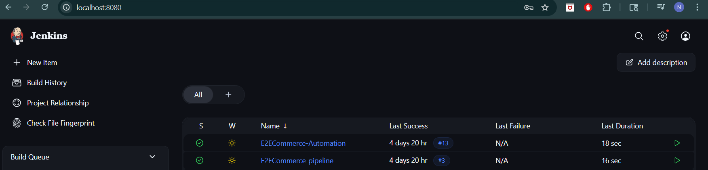
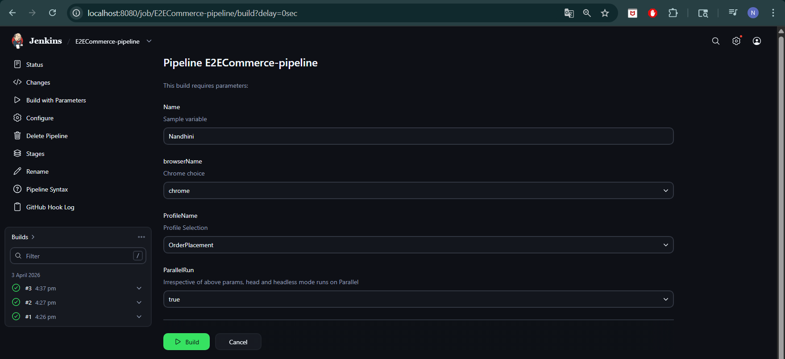
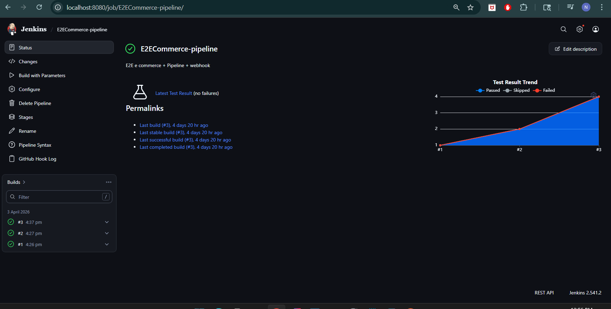
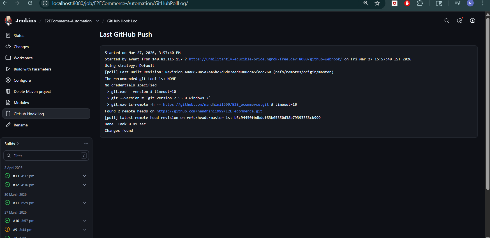

# 🛒 E2E Ecommerce Automation Framework

This project is a **hybrid end-to-end test automation framework** built for an eCommerce application.
It combines **UI + API testing** to validate complete business workflows.

This framework ensures **end-to-end validation by combining UI actions with backend API and database verification.**

---

## 🚀 Tech Stack

* **Language:** Java
* **UI Automation:** Selenium WebDriver
* **API Automation:** Rest Assured
* **Test Framework:** TestNG
* **Build Tool:** Maven
* **Design Pattern:** Page Object Model (POM)
* **Reporting:** Extent Reports / TestNG Reports
* **CI/CD:** Jenkins (GitHub Webhook + Pipeline)

---

## 📂 Project Structure

```
E2E_ecommerce
│── src
│   ├── main/java
│   │   ├── pageObjects          # UI Page classes (POM)
│   │   ├── AbstractComponents   # Reusable page object utilities
│   │   ├── resources            # Config, ExtentReports, ExcelReader
│   │   ├── DBConnection         # Database connection handling
│   │   └── utils                # JsonPathReader, Request/Response specs
│   │
│   ├── test/java
│   │   ├── tests                # UI & API test classes
│   │   ├── testComponents       # BaseTest, Listeners, Retry, POJOs
│   │   ├── data                 # Test data (JSON/Excel)
│   │   └── testSuites           # TestNG suite files
│   │        ├── testng.xml
│   │        ├── dbtestng.xml
│   │        ├── exceltestng.xml
│   │        └── APItestng.xml
│
│── ExtentReports               # Reports & screenshots
│── Jenkinsfile                 # CI/CD pipeline
│── pom.xml
│── .gitignore
│── README.md
```

---

## ⚙️ Setup Instructions

### Prerequisites

* Java 11+
* Maven
* IntelliJ IDEA

---

### Installation

```bash
git clone https://github.com/nandhini1999/E2E_ecommerce.git
cd E2E_ecommerce
```

---

### ▶️ Run Tests

```bash
mvn clean test -P<ProfileName> -DBrowserName=<browser>
```

**Example:**

```bash
mvn clean test -PQA -DBrowserName=chrome
```

---

## 📊 Reports

* TestNG default reports
* Extent Reports with screenshots

📁 Location:

```
/ExtentReports
```

---

## 🔄 CI/CD Integration (Jenkins)

* Jenkins Pipeline configured using `Jenkinsfile`
* GitHub Webhook integration enabled
* Automatic build triggered on code push
* Supports parameterized builds (Browser, Environment)


## 📸 CI/CD Execution Proof (Jenkins + Webhook)

### 🔹 Jenkins Dashboard


### 🔹 Parameterized Pipeline Execution


### 🔹 Pipeline Execution & Test Results


### 🔹 GitHub Webhook Trigger Log

---

---

## 🔑 Key Design Concepts

### 🔹 Page Object Model (POM)

* Improves maintainability
* Separates UI logic from test logic

### 🔹 POJO Classes

* Used for API request/response serialization
* Cleaner and scalable than raw JSON

### 🔹 Base Test

* Centralized setup for UI & API initialization
* Reduces duplication

### 🔹 Data-Driven Testing

* Supports Excel & JSON data
* Improves reusability

### 🔹 Retry & Listeners

* Retry mechanism for flaky tests
* TestNG listeners for reporting

---

## 🔗 Framework Highlights

* ✅ Hybrid framework (UI + API validation)
* ✅ Token-based authentication handling
* ✅ Database validation support
* ✅ Reusable request/response specs
* ✅ Cross-browser execution
* ✅ CI/CD with Jenkins + Webhook

---

## 📌 Why This Framework?

* Scalable and maintainable
* Covers complete end-to-end flow
* Industry-standard design
* CI/CD ready

---

## 🔮 Future Enhancements

* Parallel execution
* Docker integration
* Allure reporting
* Environment-based configs

---

## 👩‍💻 Author

**Nandhini Devi**
